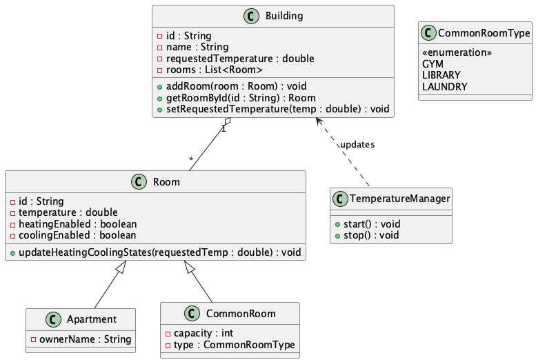
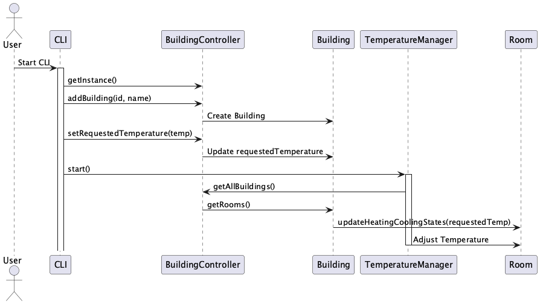
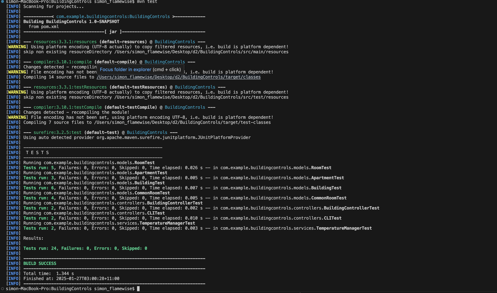
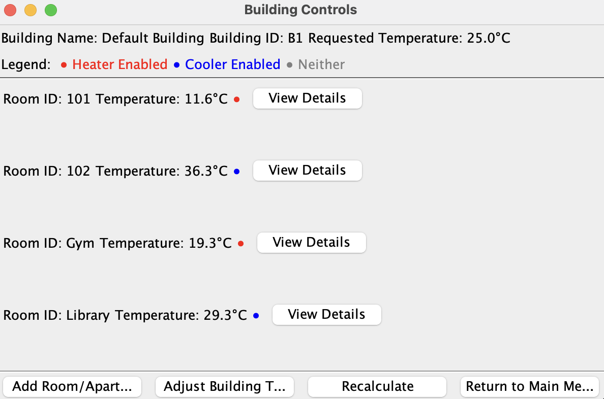
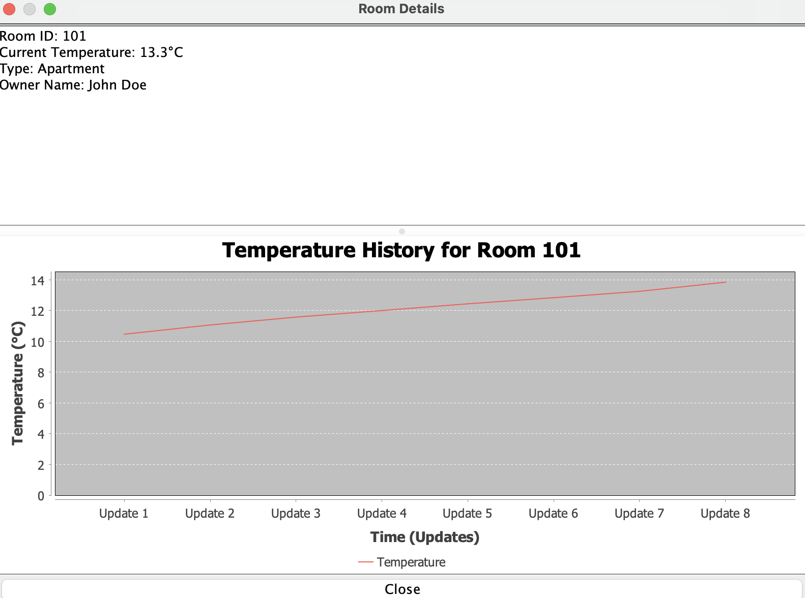

# Building Controls Application 🏢💻

## Overview
The Building Controls Application is a Java-based project designed to manage buildings, rooms, and their temperature controls. It allows users to interact with the system via either a Graphical User Interface (GUI) or a Command-Line Interface (CLI). The application provides features such as:

- 🏠 Adding and managing buildings.
- 🛏️ Adding rooms or apartments to buildings.
- 🌡️ Adjusting building-wide temperature setpoints.
- 🔄 Dynamically updating room temperatures based on heating and cooling states.

---

## Diagrams 📊

### Domain Diagram
The domain diagram illustrates the key entities and relationships in the application.


---

### Interaction Diagram
The interaction diagram shows how the CLI interacts with the `BuildingController` and other components.


---

## Features ✨

- 🏢 Manage multiple buildings with unique IDs.
- 🛋️ Support for different room types (e.g., apartments, common rooms).
- 🔄 Dynamic temperature updates using background processes.
- 🌡️ Configurable building-wide temperature setpoints.
- ✅ Graceful application lifecycle management.

---

## Requirements ⚙️

- ☕ Java 17 or higher.
- 🛠️ Maven for build management.
- 🐳 Docker (required only for CLI mode).

---

## How to Start the Application 🚀
The application can be run in either GUI mode or CLI mode. Use the provided `run.sh` script to select the desired mode of operation.

### Steps to Start the Application 🔧

1. Open a terminal and navigate to the project directory. 📂
2. Run the `run.sh` script:

```bash
./run.sh
```

3. Select the mode of operation when prompted:
- Enter `1` to launch the GUI mode. 🖥️
- Enter `2` to launch the CLI mode in a Docker container. 🐳

### GUI Mode 🖥️

The GUI mode provides a graphical interface for interacting with the application. Features include:

- A user-friendly interface to manage buildings and rooms.
- Easy navigation through menus to add buildings, adjust temperatures, and view room details.
- Dynamic updates for room heating and cooling states displayed visually.
- Designed for local environments with Java installed.

### CLI Mode 🐳

- Runs in a Docker container, making it portable and easy to deploy.
- After selecting CLI mode, the script will:
- 🏗️ Build the Docker image.
- 🎛️ Run the CLI interface in the container.
- Ensure Docker is installed and running on your system.

---

## Run Junit Test

To run the tests for this project, use the following command:

```bash
mvn test
```

Once the tests have run, you should see output similar to the screenshot below:


This output confirms the number of tests run, passed, and failed. Make sure all tests pass before deploying or committing changes.

## Bash Script Details 📜

The `run.sh` script automates the following tasks:

- 🛠️ Compiles the project using Maven.
- 🚀 Runs the application in the selected mode.

## Development Process 🛠️

### Issue Tracking and Branching Strategy
- This project uses GitHub Issues to manage and track feature requests, bug fixes, and improvements.
- Each issue is associated with a dedicated branch named using the format `type/#<issue-number>-<short-description>` for clear tracking and collaboration.
- Pull requests are created and reviewed before merging into the main or develop branches.
- Screenshot example of GitHub Issues:


### Continuous Integration
- Integrated with GitHub Actions for automated testing and validation of new commits and pull requests.
- Ensures consistent code quality and prevents regressions during development.
- Screenshot example of GitHub Actions:


### Realistic Temperature Adjustments Using Normal Distribution 📈🌡️

The application leverages a **normal distribution** to simulate temperature adjustments, aiming to mimic real-world behavior where changes are not uniform or linear. This approach provides a more natural and realistic progression of room temperatures, ensuring gradual and varied updates.

#### Key Design Elements:
1. **Temperature Adjustment Based on System State**:
   - **Heating Enabled**: A positive adjustment is applied, gradually increasing the room temperature.
   - **Cooling Enabled**: A negative adjustment is applied, gradually decreasing the room temperature.
   - **No Heating or Cooling**: Minor random fluctuations are introduced to simulate natural environmental changes.

2. **Normal Distribution for Adjustments**:
   - The system uses a **mean (average)** adjustment value of `0.5` for heating or cooling, representing typical changes over time.
   - A **standard deviation (spread)** of `0.1` ensures variation, creating a more dynamic and lifelike simulation.
   - Adjustments are generated using the formula:
     ```java
     mean + stdDev * random.nextGaussian();
     ```

3. **Minor Fluctuations for Inactivity**:
   - When neither heating nor cooling is active, small random fluctuations centered around `0.0` are introduced, with a standard deviation of `0.1`.
   - This simulates slight environmental changes even in stable conditions.

4. **Clamping for Stability**:
   - Room temperatures are clamped within ±1.0°C of the building's requested temperature to avoid unrealistic deviations while maintaining flexibility for natural changes.

#### Benefits of Normal Distribution Design:
- **Realism**: Mimics the randomness and gradual nature of temperature changes in real-world systems.
- **Dynamic Behavior**: Prevents abrupt or uniform updates, keeping the simulation engaging and accurate.
- **Controlled Fluctuations**: Ensures temperature adjustments are meaningful and within realistic bounds.

By integrating normal distribution, the application achieves a balance between realism and control, offering users an intuitive and lifelike temperature control experience. This approach aligns with findings by Sempey et al. (2009), who highlighted the importance of fast simulations and realistic distributions for temperature control systems in air-conditioned rooms【Sempey et al., 2009】.

## Application Screenshots 📸

### Room Overview
The Room Overview screen displays a list of all rooms in the selected building, including their current temperature, status (Heater/Cooler/Neither), and a button to view detailed information for each room.



---

### Room Details
The Room Details screen provides in-depth information about a specific room, including its type, current temperature, and a temperature history graph to visualize changes over time.



## Concurrency in Temperature Management 🕒

The application leverages concurrency to simulate real-time temperature adjustments in buildings and rooms. This design provides realistic and dynamic updates for room temperatures, ensuring heating and cooling states are adjusted periodically based on the requested building temperature.

### Key Components:

1. **Room Class**:
   - Maintains the temperature state of each room along with its heating and cooling status.
   - Uses a thread-safe list (`temperatureHistory`) to store historical temperature data.
   - Provides the `updateHeatingCoolingStates` method to enable or disable heating/cooling based on the requested temperature, with a tolerance of ±0.5°C to simulate realistic behavior.

   ```java
   public void updateHeatingCoolingStates(double requestedTemperature) {
       double tolerance = 0.5;
       if (temperature < requestedTemperature - tolerance) {
           heatingEnabled = true;
           coolingEnabled = false;
       } else if (temperature > requestedTemperature + tolerance) {
           coolingEnabled = true;
           heatingEnabled = false;
       } else {
           heatingEnabled = false;
           coolingEnabled = false; // Within tolerance
       }
   }
   ```

2. **TemperatureManager Class**:
   - Uses a `ScheduledExecutorService` to periodically update room temperatures every 5 seconds.
   - Adjusts temperatures based on heating/cooling states using a normal distribution for realistic variation.

   ```java
    public void start() {
        scheduler.scheduleAtFixedRate(this::updateTemperatures, 0, 5, TimeUnit.SECONDS);
    }
    ```

   - Introduces minor random fluctuations when neither heating nor cooling is enabled, mimicking real-world environmental changes.

   ```java
    private double generateMinorFluctuation() {
        double mean = 0.0; // Center around no change
        double stdDev = 0.1; // Small standard deviation
        return mean + stdDev * random.nextGaussian();
    }
   ```

3. **Thread Safety**:
   - The temperature adjustment logic ensures that data consistency is maintained even when multiple rooms or buildings are updated concurrently.
   - The `ScheduledExecutorService` isolates temperature updates in a dedicated background thread, minimizing interference with other application features.

### Real-World Simulation:
By periodically adjusting temperatures and allowing minor fluctuations, the system simulates real-world temperature dynamics in air-conditioned or heated environments. This design is inspired by research on temperature distribution in buildings, such as Sempey et al.'s work on fast temperature simulations in air-conditioned rooms.

This concurrency-driven approach ensures that the application's temperature management remains efficient, realistic, and responsive to user-defined settings, providing an engaging and immersive user experience.
